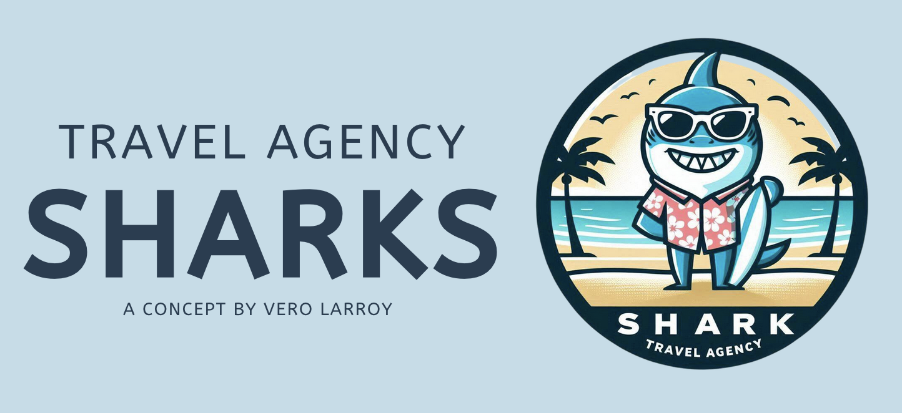

# Shark Attacks Analysis Project



## Project Overview

Welcome to the Shark Attacks Analysis Project! This project aims to analyze shark attacks data to gain insights into shark behavior, locations, and activities associated with shark attacks. The findings from this analysis are used to create a fictitious travel agency focused on sharks, offering two unique travel plans: 

- **Shark Adventurer**: For sharks that want to go on vacation and have blood.
- **Shark Recreational**: For sharks that want a more relaxed and chill holiday.

## Graphs Included

The analysis includes the following visualizations:

1. **Shark Attack Counts by Year (2005 onwards)**:
   - This graph shows the number of shark attacks each year from 2005 onwards.

2. **Severe and Minor Injuries by Country with Blood Index (Top 3 Countries)**:
   - This visualization displays the severe and minor injuries by country, focusing on the top 3 countries. It also includes the blood index, which is a ratio of severe to minor injuries.

3. **Severe and Minor Injuries by Activity Category with Blood Index (Top 3 Activity Categories)**:
   - This graph shows the severe and minor injuries by activity category, highlighting the top 3 activities. The blood index is included to indicate the ratio of severe to minor injuries.

4. **Severe and Minor Injuries by Species Category with Blood Index (Top 3 Species Categories)**:
   - This plot presents the severe and minor injuries by species category, focusing on the top 3 species. The blood index is included to show the ratio of severe to minor injuries.

5. **Distribution of Shark Attacks by Sex**:
   - This bar chart displays the distribution of shark attacks by sex.

6. **Shark Attack Severity by Species**:
   - This bar chart shows the severity of shark attacks (minor and severe injuries) by species.

## Purpose

The purpose of this project is to analyze the shark attacks dataset to support the creation of a fictitious travel agency that caters to sharks. The agency offers two main travel plans:

- **Shark Adventurer**: A vacation plan for sharks that want an adventurous trip with opportunities to encounter blood.
- **Shark Recreational**: A more relaxed holiday plan for sharks that prefer a peaceful and chill vacation.

## Getting Started

To view the analysis and the visualizations, open the Jupyter notebook `sharks_final_github.ipynb`. The notebook contains all the code and plots generated during the analysis.

## Prerequisites

To run the notebook, you need to have the following libraries installed:
- pandas
- numpy
- seaborn
- matplotlib
- re
- datetime

You can install these libraries using pip:
```bash
pip install pandas numpy seaborn matplotlib